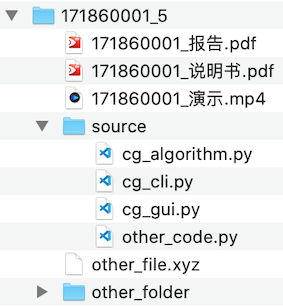

# 南京大学《计算机图形学》课程大作业

## 更新记录
- \[2020/10/15 21:13\] 更新测试文本文件及参考结果图片

## Q&A
1. 关于绘制时的纵坐标转换是什么意思？

    需要实现的绘制坐标系的坐标原点在屏幕左上方（往右为x正方向，往下为y正方向），而常规的二维坐标系是左下方为坐标原点（往右为x正方向，往上为y正方向）。

2. 操作指令如果出现旋转椭圆怎么办？

    测试数据不会出现规定之外的非法操作

## 1. 作业内容
本课程作业是横跨一学期的项目，要求跟随课程进度在项目中实现各种图形学算法，最终完成一个完整的图形学系统，进度自由安排，**`9月30日`**、**`10月31日`**、**`11月30日`**提交**进度报告**和**已完成代码**，**`12月26日`**提交**系统报告**、**完整的系统**、**系统使用说明书**和**系统演示视频**。

- 截止时间：
  
    > 提交日的 **`23:00`**

- 提交方式：
  
    > **`提交前请仔细检查压缩包中是否已包含所有必要内容（系统代码、系统报告、使用说明书、演示视频），务必按要求组织文件结构和命名文件。`**
    
- 提交内容：
  
    > 一个`7z`压缩包

- 命名方式：
    >“学号\_月份.7z”，例如“17186001\_9.7z”。当提交错误，或有内容更新时，加上“\_v2”、“\_v3”等后缀重新提交，例如“17186001\_9\_v2.7z”。以截止时间前最晚的提交为准
    >
    > **`！！！重要`**：请务必按要求命名，以免评分和查重时出现意外

- 文件结构：
    > ```
    > 学号_月份
    > |- 学号_报告.pdf
    > |- 学号_说明书.pdf
    > |- 学号_演示.mp4
    > |- source
    > |  |- cg_algorithms.py
    > |  |- cg_cli.py
    > |  |- cg_gui.py
    > |  |- ...
    > |- ...
    > ```
    > 例如
    >
    > 
    >
    > **`！！！重要`**：请务必按要求组织文件结构，以免评分和查重时出现意外

## 2. 系统实现要求

使用[Python3](https://www.python.org)语言编程，实现一个绘图系统

### 2.1. 要实现的内容
- 核心算法模块（各种图元的生成、编辑算法）：cg_algorithms.py
    > - 只允许依赖math库
    > - 参考[CG_demo/cg_algorithms.py](CG_demo/cg_algorithms.py)
- 命令行界面（CLI）程序：cg_cli.py
    > - 读取包含了图元绘制指令序列的文本文件，依据指令调用核心算法模块中的算法绘制图形以及保存图像
    > - 允许依赖第三方库[numpy](https://pypi.org/project/numpy/)和[Pillow](https://pypi.org/project/Pillow/)，用于将画布保存为图像
    > - 程序接受两个外部参数：指令文件的路径和图像保存目录
    > - 测试程序时的指令格式如下：
    >   
    >    >```
    >    >python cg_cli.py input_path output_dir
    >    >```
    > - 参考[CG_demo/cg_cli.py](CG_demo/cg_cli.py)
- 用户交互界面（GUI）程序：cg_gui.py
    > - 以鼠标交互的方式，通过鼠标事件获取所需参数并调用核心算法模块中的算法将图元绘制到屏幕上，或对图元进行编辑
    > - 要实现[2.2节](#22-指令文件格式)中的所有功能
    > - 界面样式和交互方式不做限制，可自由设计
    > - 可自由选择GUI库，如[PyQt5](https://pypi.org/project/PyQt5/)、Tkinter等
    > - 测试程序时的指令格式如下：
    >   
    >    >```
    >    >python cg_gui.py
    >    >```
    > - 参考[CG_demo/cg_gui.py](CG_demo/cg_gui.py)

[CG_demo](CG_demo)仅提供了一种简单的系统架构及交互逻辑，可以直接在此基础上丰富、优化功能；也可以另起炉灶，设计更优秀的系统架构和交互方式。

### 2.2. 指令文件格式
每行一条指令，包括：
- 重置画布
    > ```
    > resetCanvas width height
    > ```
    >
    > 清空当前画布，并重新设置宽高
    >
    > width, height: int
    >
    > 100 <= width, height <= 1000

- 保存画布
    > ```
    > saveCanvas name
    > ```
    >
    > 将当前画布保存为位图name.bmp
    >
    > name: string

- 设置画笔颜色
    > ```
    > setColor R G B
    > ```
    > 
    > R, G, B: int
    > 
    > 0 <= R, G, B <= 255

- 绘制线段
    > ```
    > drawLine id x0 y0 x1 y1 algorithm
    > ```
    >
    > id: string, 图元编号，每个图元的编号是唯一的
    > 
    > x0, y0, x1, y1: int, 起点、终点坐标
    > 
    > algorithm: string, 绘制使用的算法，包括"DDA"和"Bresenham"

- 绘制多边形
    > ```
    > drawPolygon id x0 y0 x1 y1 x2 y2 ... algorithm
    > ```
    >
    > id: string, 图元编号，每个图元的编号是唯一的
    > 
    > x0, y0, x1, y1, x2, y2 ... : int, 顶点坐标
    > 
    > algorithm: string, 绘制使用的算法，包括"DDA"和"Bresenham"

- 绘制椭圆（中点圆生成算法）
    > ```
    > drawEllipse id x0 y0 x1 x1
    > ```
    >
    > id: string, 图元编号，每个图元的编号是唯一的
    > 
    > x0, y0, x1, y1: int, 椭圆矩形包围框的~~左上角和右下角~~对角顶点坐标

- 绘制曲线
    > ```
    > drawCurve id x0 y0 x1 y1 x2 y2 ... algorithm
    > ```
    > 
    > id: string, 图元编号，每个图元的编号是唯一的
    > 
    > x0, y0, x1, y1, x2, y2 ... : int, 控制点坐标
    >
    > algorithm: string, 绘制使用的算法，包括"Bezier"和"B-spline", 其中"B-spline"要求为三次（四阶）均匀B样条曲线，曲线不必经过首末控制点

- 图元平移
    > ```
    > translate id dx dy
    > ```
    > 
    > id: string, 要平移的图元编号
    > 
    > dx, dy: int, 平移向量

- 图元旋转
    > ```
    > rotate id x y r
    > ```
    > 
    > id: string, 要旋转的图元编号
    > 
    > x, y: int, 旋转中心
    > 
    > r: int, 顺时针旋转角度（°）

- 图元缩放
    > ```
    > scale id x y s
    > ```
    > 
    > id: string, 要缩放的图元编号
    > 
    > x, y: int, 缩放中心
    >
    > s: float, 缩放倍数

- 对线段裁剪
    > ```
    > clip id x0 y0 x1 y1 algorithm
    > ```
    >
    > id: string, 要裁剪的线段编号
    > 
    > x0, y0, x1, y1: int, 裁剪窗口的~~左上角和右下角~~对角顶点坐标
    > 
    > algorithm: string, 裁剪使用的算法，包括"Cohen-Sutherland"和"Liang-Barsky"

说明：
- 参考[CG_demo/input.txt](CG_demo/input.txt)，测试时保证所有指令都是合法的
- 图元不需要填充内部颜色
-  ~~绘制图像时需要转换坐标：图像坐标系的y轴方向是反的，所以坐标(x,y)的点应当绘制在图像中(x,height-1-y)坐标的像素上~~
--->绘制坐标与屏幕坐标统一，以左上为原点，x轴指向右，y轴指向下
- 不需要对椭圆进行旋转
- 平移、旋转以绘制出来的图像的视觉效果为准

## 3. 进度报告/系统报告要求
- 在上个月报告的基础上添加本月新的内容即可，无需从头重写

- 报告内容包括：
    > - 已完成或拟采用算法的原理介绍、自己的理解、对比分析等
    > - 已完成或拟采用的系统框架、交互逻辑、设计思路等
    > - 介绍自己系统中的巧妙的设计、额外的功能、易用的交互、优雅的代码、好看的界面等（可选）
- 请附上联系方式（邮箱或QQ等），以便出现问题时及时联系
- 需注明在实现作业过程中使用的参考资料，包括技术博客等
- 可添加附加材料(觉得需要附加说明的代码等)
- 使用助教提供的Word或LaTeX文档模板撰写报告，Word需要另存为或打印为pdf文件后再提交

## 4. 系统使用说明书要求
- 说明开发环境，包括用到的第三方库及其版本
- 对系统每个功能进行介绍并截图展示运行结果，清楚说明系统操作方式
- 需要生成为pdf文件后提交

## 5. 系统演示视频要求
- 展示你的GUI程序中实现的所有功能
- 直接录制的视频通常体积较大，请压制后再提交：
    > 可安装[ffmpeg](https://www.ffmpeg.org)后，用以下指令压制：
    > ```
    > ffmpeg -i input.mov -b:v 4000k output.mp4
    > ```
    也可自行探索更合适的压制参数，或者使用其他压制工具
- 前两次进度报告`不要`提交视频文件

## 6. 测试环境说明
测试环境为[VirtualBox](https://www.virtualbox.org/wiki/Downloads)虚拟机：
- [Ubuntu 18.04 x86_64](https://ubuntu.com)
- [Python 3.7.4](https://www.python.org)
    - [numpy 1.18.1](https://pypi.org/project/numpy/)
    - [pillow 7.0.0](https://pypi.org/project/Pillow/)
    - [pyqt 5.9.2](https://pypi.org/project/PyQt5/)

CLI程序原则上只允许依赖numpy和pillow两个第三方库；GUI程序如果有其他特殊需求，要在系统使用说明书中注明。

## 7. 开发环境配置
不必和测试环境完全一致，python和python库的小版本不同一般不会影响程序运行。

- 简单方法一：
  
    > 安装[Anaconda](https://www.anaconda.com/distribution/#download-section)，大而全，包含了numpy、Pillow、PyQt5和很多其他常用库
- 简单方法二：
    > 直接在测试环境虚拟机中开发，需要自行配置IDE/编辑器。
    >
    > 虚拟机文件[下载地址](https://box.nju.edu.cn/d/19abd9b3c3c54b95ab3c/)，密码：cg2020 (虚拟机内环境登录账号：cg 密码：cg)

IDE/编辑器选择：
- [PyCharm](https://www.jetbrains.com/pycharm/download/)：功能强大
- [Spyder](https://www.spyder-ide.org)：Anaconda自带
- [VSCode](https://code.visualstudio.com)+[Python extension](https://marketplace.visualstudio.com/items?itemName=ms-python.python)：轻量级
- [...](https://wiki.python.org/moin/IntegratedDevelopmentEnvironments)

## 8. 评分标准
- 核心算法模块+CLI程序：40分
    > 由评分脚本自动运行程序，给定输入文件，比较生成的图像与标准答案（有容错机制，不要求像素级一致）
    > 
    > 对于没有得到满分的程序，我们会人工二次检查
- GUI程序+系统演示视频：30分
    > 通过鼠标交互实现[2.2节](#22-指令文件格式)中的所有功能，即可得到满分
    >
    > 实现额外的图形学功能、重新设计更好的程序架构和交互逻辑等，能够提升给报告评分时的宽容度
- 进度报告+系统报告+系统使用说明书：30分
    
    > 按时提交进度报告能够提升评分时的宽容度

